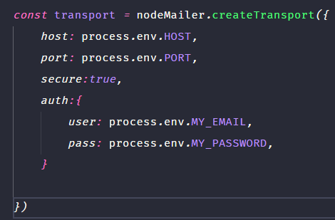

# portfolio backend

* backend part of my port folio project, which has the functionality to handle sending email

### used libraries:
> - Express
> - nodemailer
> - dotenv

### installing dependencies:
> - yarn or npm i

## how to configure the variables of the .env file?
 follow the image below

#
* first create an .env file in the project root
#
* in the host variable you must enter the smtp of your email in which you will receive the email sent, to find it just put smtp in your browser and the type of your email, for example *smtp gmail*

#
* on the port just enter the email receiving port on which your email provides
#
* in secure if your port is above 465 you must add false , if it is below or equal to 465 you must add true

#

* in myemail you add your email that will receive the email sent

#

*  in the part of my_password you will add your password, if your email is of the gmail type you must create an app password that works as an alternative password for you to use in your app, just go to manage your account, then go to security and look for app password, if it is not visible, your account password is probably not configured with two-step authentication, to use the app password, your account must be configured with verification, then just get your password and add the variable to my_password

[portuguese](./readme.potuguese.md)
