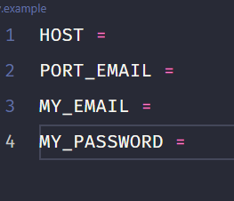

# portfólio de back-end

* parte de backend do meu projeto port folio, que tem a funcionalidade de lidar com o envio de e-mail

### bibliotecas usadas:
> - Express
> - nodemailer
> - dotenv

### instalando dependências:
> - yarn ou npm i

## como configurar as variáveis ​​do arquivo .env?
 segue a imagem abaixo

#
* primeiro crie um arquivo .env na raiz do projeto
#
* na variável host você deve inserir o smtp do seu email em que receberá o email enviado, para encontrá-lo basta colocar o smtp no seu navegador e o tipo do seu email, por exemplo *smtp gmail*

#
* na  port_email  basta digitar a porta de recebimento de e-mail na qual seu e-mail fornece
#
* em secure se sua porta estiver acima de 465 você deve adicionar false , se estiver abaixo ou igual a 465 você deve adicionar true

#

* em my_email você adiciona seu e-mail que receberá o e-mail enviado

#

* na parte de my_password você vai adicionar sua senha, se seu email for do tipo gmail você deve criar uma senha de app que funcione como uma senha alternativa para você usar em seu app, basta ir em gerenciar sua conta, depois ir em security e procure a senha do app, caso não esteja visível, a senha da sua conta provavelmente não está configurada com autenticação em duas etapas, para usar a senha do app, sua conta deve estar configurada com verificação, então é só pegar sua senha e adicionar a variável a minha senha

